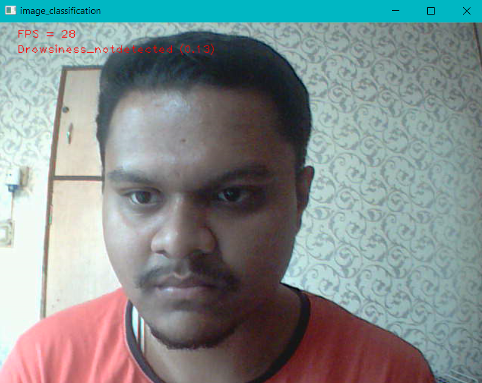
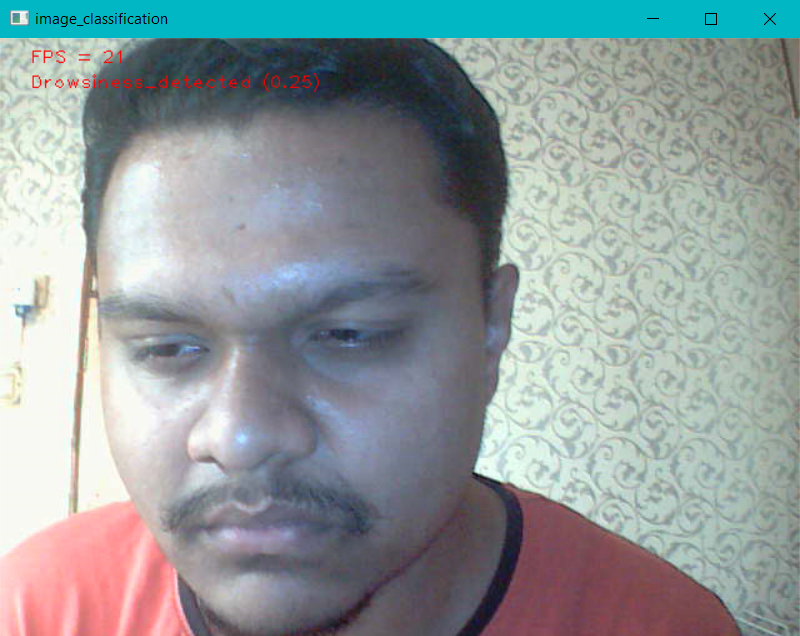
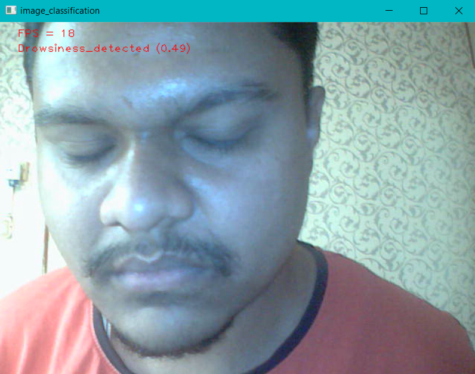
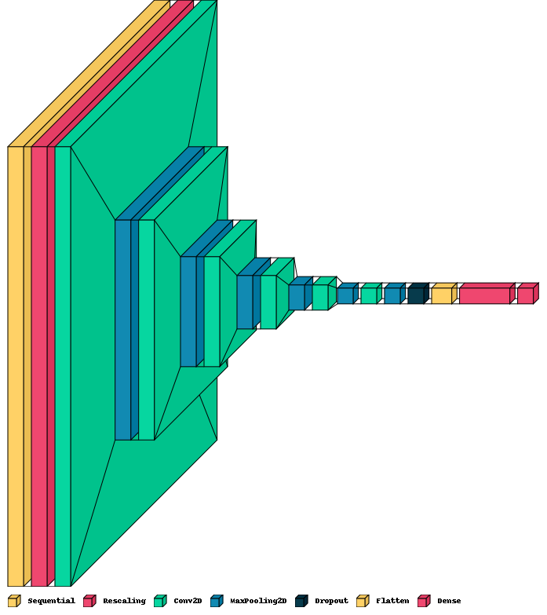

# DSM 

The DSM system detects whether a driver of an automobile is feeling sleepy using a camera and TensorFlow-lite model.

The training notebook is [*Train_NB.ipynb*](https://github.com/imPdhar/DSM/blob/master/Train_NB.ipynb)

Model directory is [lite/examples/image_classification/raspberry_pi/](https://github.com/imPdhar/DSM/tree/master/lite/examples/image_classification/raspberry_pi)

## The problem statement

Given was a pre-cleaned and pre-normalized dataset from Kaggle which had just two classes - Open eyes and Closed eyes.

The way how this helps us in creating a drowsiness detector is by the fact that drowsiness may be defined by an action that involves closing eyes due to the fatigue of the driver.

## Proof of concept

When driver is active

When driver is slightly drowsy

When driver starts sleeping on the wheel

## DSM Model architecture

The initialized keras sequential model consisted of:

1. data_augmentation -- Data Augmentation layer to apply Random Flip, Random Rotation, and Random Zoom effect on images
2. Rescaling(1./255) -- Rescale images 
3. Conv2D(16, 5, padding='same', activation='relu'  -- Convolution layer with 5x5 strides and 16 filters activated with Rectified Linear Unit activation function
4. MaxPooling2D(),    -- Pool maximum values of individual pixels and reduce size by half
5. Conv2D(32, 5, padding='same', activation='relu'), -- Convolution layer with 5x5 strides and 32 filters activated with Rectified Linear Unit activation function
6. MaxPooling2D(), -- Pool maximum values of individual pixels and reduce size by half
7. Conv2D(64, 3, padding='same', activation='relu'), -- Convolution layer with 3x3 strides and 64 filters activated with Rectified Linear Unit activation function
8. MaxPooling2D(), -- Pool maximum values of individual pixels and reduce size by half
9. Conv2D(64, 3, padding='same', activation='relu'), -- Convolution layer with 3x3 strides and 64 filters activated with Rectified Linear Unit activation function
10. MaxPooling2D(), -- Pool maximum values of individual pixels and reduce size by half
11. Conv2D(64, 3, padding='same', activation='relu'), -- Convolution layer with 3x3 strides and 64 filters activated with Rectified Linear Unit activation function
12. MaxPooling2D(), -- Pool maximum values of individual pixels and reduce size by half
13. Conv2D(64, 5, padding='same', activation='relu'), -- Convolution layer with 5x5 strides and 64 filters activated with Rectified Linear Unit activation function
14. MaxPooling2D(), -- Pool maximum values of individual pixels and reduce size by half
15. Dropout(0.2), -- Randomly deactivate/dropout 20% of neurons to normalize and help in reducing overfitting
16. Flatten(), -- Flatten tensors 
17. Dense(640, activation='relu'),  -- 640 dense layer neurons with Rectified Linear Unit activation to simplify weight distribution
18. Dense(2) -- 2 neurons because of 2 classes in the dataset. Acquires probability of both the function. 

**Optimizer:** **Adam optimizer** to adjust learning rate as per the momentum required

**Loss function - SparseCategoricalEntropy**: Entropy across the network is acquired across different classes. Mostly used in Multiclass classification but gives good accuracy in Binary Classification problems too.

## Usage for inference

1) Make sure your computer is connected to a webcam.
2) Go to the directory of the model - 'tree/master/lite/examples/image_classification/raspberry_pi' (`cd ../tree/master/lite/examples/image_classification/raspberry_pi`)
3) Run requirements.txt to install required libraries using `pip install -r requirements.txt` 
4) After installation, run `python classify.py --model eyemodel1_metadata.tflite ` to get real-time video inference

## 

